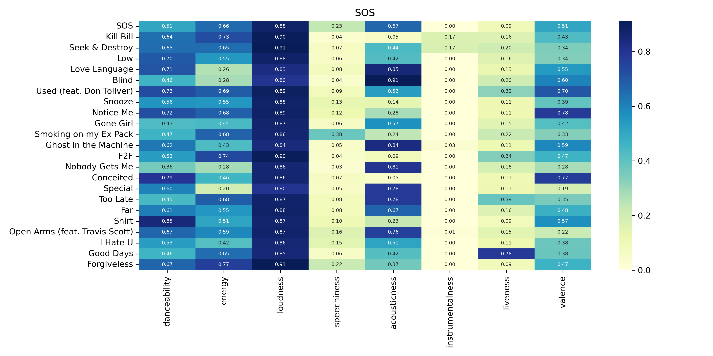

# Spotify Audio Features Heatmap

## Overview

This Python project uses the Spotipy library to interact with the Spotify Web API. Given an album URL, it retrieves the audio features of all the tracks on that album and plots a Seaborn heatmap to visualize these features.

## Requirements

- Python 3.6 or higher
- Spotipy library (for accessing the Spotify Web API)
- Seaborn library (for creating the heatmap)
- Matplotlib library (for displaying the heatmap)
- Pandas library (for data manipulation)
- python-dotenv library (for managing environment variables)
- sys library (for command line arguments)


## Getting Started
1. Clone this repository:
``` bash
git clone https://github.com/ahcrej/spotify-audio-features-heatmap.git
cd spotify-audio-features-heatmap
```
2. Create a Spotify Developer App:
- Go to the Spotify Developer Dashboard.
- Create a new app and note down your client ID and client secret.

3. Set up your environment variables:
- Create a .env file in the project directory and add your Spotify API credentials:

``` env
SPOTIPY_CLIENT_ID = your_client_id
SPOTIPY_CLIENT_SECRET = your_client_secret
```

4. Run the script by executing the following command in your terminal or command prompt, and replace `album_url` with the Spotify album URL you want to analyze:

```bash
python spotipy_project.py album_url
```
- For example, to analyze the album "SOS" by SZA, you would run:

```bash
python spotipy_project.py https://open.spotify.com/album/07w0rG5TETcyihsEIZR3qG
```
- The heatmap will be generated and saved as album_name.png in the project directory.

## Example

Here's an example heatmap generated for the album "SOS" by SZA:

